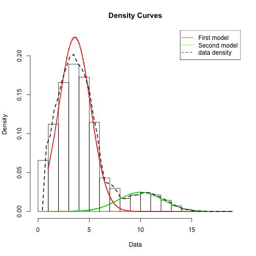
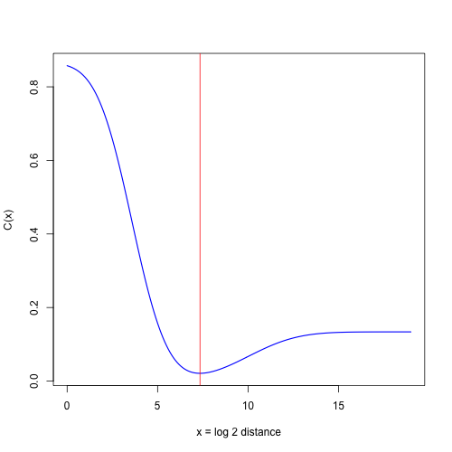
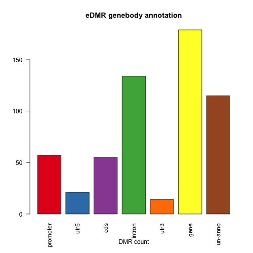
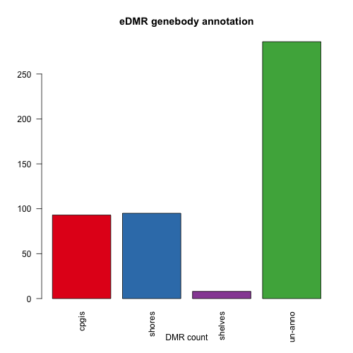

edmr
====

Optimized DMR analysis based on bimodal normal distribution model and cost function for regional methylation analysis.

Citing edmr
---------
Li S, Garrett-Bakelman FE, Akalin A, Zumbo P, Levine R, To BL, Lewis ID, Brown AL, D'Andrea RJ, Melnick A, Mason CE. An optimized algorithm for detecting and annotating regional differential methylation. BMC Bioinformatics. 2013;14 Suppl 5:S10.

Installation
---------
```R
install.packages( c("data.table", "mixtools", "devtools"))
source("http://bioconductor.org/biocLite.R")
biocLite(c("GenomicRanges","IRanges"))
# install from github
library(devtools)
install_github("edmr", username = "ShengLi",build_vignettes=FALSE)
```

Usage
---------
Step 1. Load add-on packages and example data

```R
library(edmr)
library(GenomicRanges)
library(mixtools)
library(data.table)
data(edmr)
```

Step 2. myDiff evalution and plotting

```R
# fitting the bimodal normal distribution to CpGs distribution
myMixmdl=myDiff.to.mixmdl(myDiff, plot=T, main="example")

# plot cost function and the determined distance cutoff
plotCost(myMixmdl, main="cost function")
```
 



Step 3. Calculate DMRs

```R
# calculate all DMRs candidate
mydmr=edmr(myDiff, mode=1, ACF=TRUE)

# further filtering the DMRs
mysigdmr=filter.dmr(mydmr)

## annotation
# get genebody annotation GRangesList object
genebody=genebody.anno(file="http://edmr.googlecode.com/files/hg19_refseq_all_types.bed")

# plot the eDMR genebody annotation
plot.dmr.distr(mysigdmr, genebody, main="eDMR genebody annotation", xlab="DMR count")

# get CpG islands and shores annotation
cpgi=cpgi.anno(file="http://edmr.googlecode.com/files/hg19_cpgisland_all.bed")

# plot the eDMR CpG islands and shores annotation
plot.dmr.distr(mysigdmr, cpgi, main="eDMR CpG islands and shores annotation", xlab="DMR count")

# prepare genes for pathway analysis with significant DMRs at its promoter regions 
dmr.genes=get.dmr.genes(myDMR=mysigdmr, subject=genebody$promoter, id.type="gene.symbol")
dmr.genes
```
 

